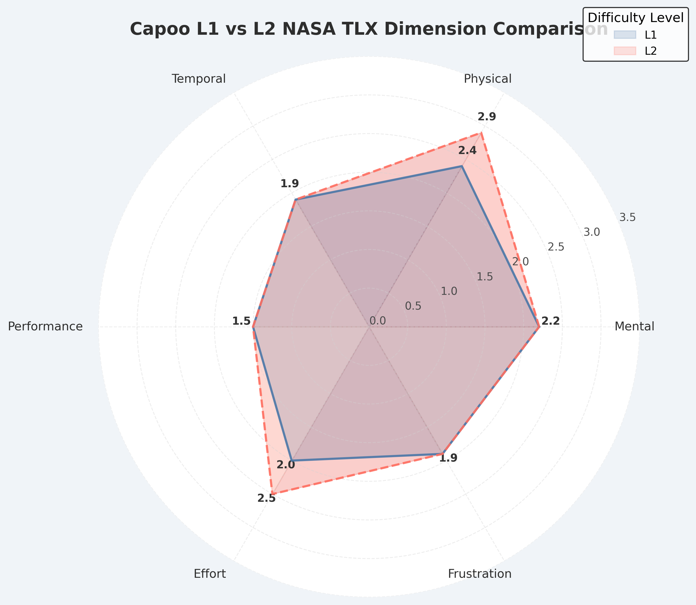
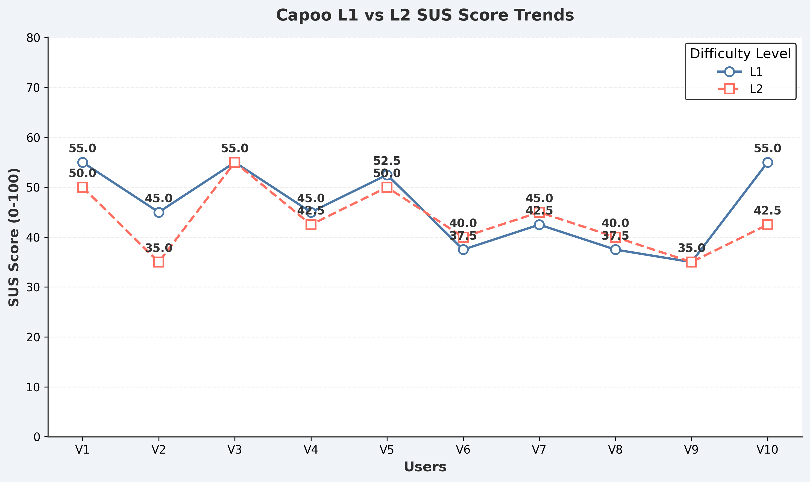
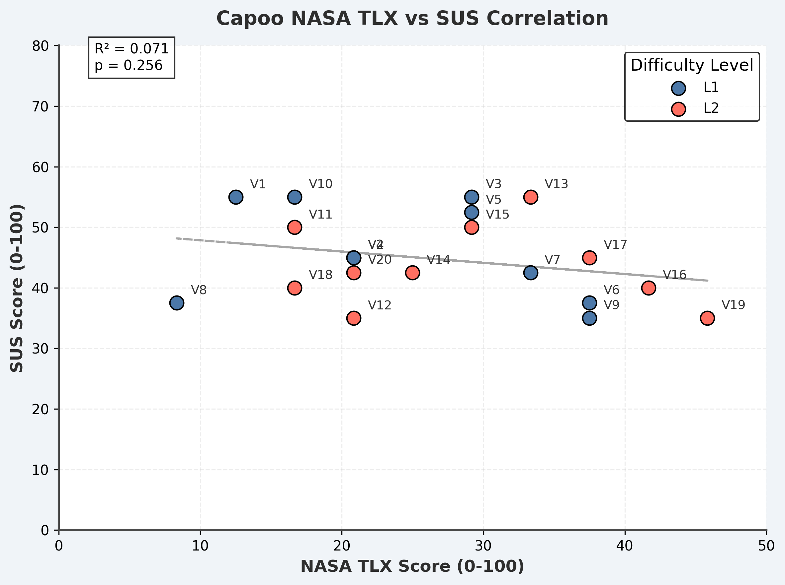

# 2025-group-3
2025 COMSM0166 group 3

## Your Game

  <a href="https://uob-comsm0166.github.io/2025-group-3/game/">🎮 Capoo Game Demo 😻</a>

 

Your game lives in the [/docs](/docs) folder, and is published using Github pages to the link above.

Include a demo video of your game here (you don't have to wait until the end, you can insert a work in progress video)

## Your Group

| Name | Email | Github | Role |
| -- | -- | -- | -- |
| Shuyin Deng | ta24493@bristol.ac.uk | @Ruby-sy | Project Manager |
| Jiaxin Fan | sg24148@bristol.ac.uk | @paidaxin760 | Technical Writer |
| Peixuan Li | ra24381@bristol.ac.uk | @pluvo070 | Developer |
| Yibu Ma | sd24536@bristol.ac.uk | @Grooveofmimosa | Developer |
| Yu Qiu | kp24679@bristol.ac.uk | @PekkaLnx | Developer |
| Jiahao Liu | qi24477@bristol.ac.uk | @TYHD759 | Test Engineer |

## Your Kanban

[Kanban board](https://github.com/orgs/UoB-COMSM0166/projects/76)

## Project Report

### 1. Game Reserch and idea
| **Game Type** | **Game Inspiration** | **Game Description** | **Possible Game Twists** |
|-----------------|------------------------|------------------------|----------------------------|
| **🌱 Simulation, RPG** | 🏡 **Stardew Valley** | A game combining **farm management, social interaction, exploration, and combat.** Players manage their farm, interact with NPCs, and explore unknown areas. | ✨ Add a **magic system,** random events, or **dynamic weather** affecting crop growth. |
| **⚔️ Strategy RPG** | 🏰 **The DioField Chronicle** | A **real-time tactical battle** game blending **political storytelling** and **strategic warfare**. Players **lead armies** and influence the story. | 🔀 Add **multiple endings** or introduce a **customizable character development path**. |
| **🔫 Roguelike Action** | 💥 **Neon Abyss** | A **fast-paced shooting game** featuring **procedurally generated levels** and various **weapon upgrades**. | 🎯 Introduce **character progression mechanics**, **increase long-term growth**, or **add random combat-affecting events**. |
| **🧪 Crafting Simulation** | 🏺 **Potion Craft: Alchemist Simulator** | Players take on the role of an **alchemist**, combining ingredients to craft potions while managing a shop. | 🏆 Add **alchemy duels** or introduce **hidden quests & unique customer requests**. |
| **🏰 Tower Defense** | 🎈 **Bloons Tower Defense** | Players **place and upgrade towers** to **prevent balloon waves** from reaching their goal. | 🎭 Introduce a **PVP mode** or **dynamic map alterations**. |
| **🏰 Tower Defense** | 🏹 **Kingdom Rush** | A **tower defense game** with **hero units** and **diverse upgrade options** against enemy waves. | 🦸 Add **RPG mechanics** allowing **direct hero control in battles**. |
| **🧗 Platformer** | 🌄 **Celeste** | A **platforming game** about **climbing Celeste Mountain**, featuring **precise controls & emotional storytelling**. | ⏳ Add a **time trial mode** or a **level editor** for **custom challenges**. |
| **⚔️ MMORPG, Action** | 🏆 **Dungeon Fighter Online (DNF)** | A **side-scrolling action MMORPG**, blending **dungeon exploration** and **character development**. Players **level up & collect loot**. | 🎮 Introduce **PVP arenas** or **dynamic event dungeons**. |
| **🃏 Roguelike Deck-Building** | 🎴 **Slay the Spire** | Players **build a deck** and battle through **procedurally generated levels**, making each run unique. | 🤝 Introduce **co-op** or **PVP battle modes** for **competitive deck-building**. |
| **🗡️ Roguelike Metroidvania** | 🔥 **Dead Cells** | A **Metroidvania-style combat game** with **procedurally generated dungeons & fluid combat**. | ⚙️ Add a **customizable weapon system** or **multi-character control mechanics**. |
| **💀 Action Roguelike** | ⚔️ **Skul: The Hero Slayer** | Players control **a small skeleton warrior** who can **acquire and switch hero abilities**. | 🏅 Introduce **PVP battles** or **expand the number of transformable heroes**. |
| **🏛️ Action Roguelike** | 🔱 **Hades** | Players control **Zagreus, the son of Hades**, trying to escape the underworld. Each failure **progresses the story**. | 👹 Add a **'Nightmare Mode'** with **stronger enemies** or **randomized skill selection**. |
| **🧛 Survival, Roguelike** | 🦇 **Vampire Survivors** | Players **auto-attack and upgrade abilities**, surviving **endless enemy waves**. | 💡 Add a **character talent system** or **customizable attack styles**. |
| **🏰 Strategy, Simulation** | 👑 **Kingdom: Two Crowns** | Players **manage and expand their kingdom** while **defending against nightly monster invasions**. | 🌦️ Introduce **seasons affecting resources** or **AI-controlled kingdoms competing dynamically**. |
| **🃏 Card Game** | 🔮 **Hearthstone** | A **card battle game** set in the **World of Warcraft universe**, where players **build decks & compete**. | 🎭 Introduce **new game modes**, such as **'Survival Mode'** where players **continuously battle AI opponents**. |
| **💣 Action, Multiplayer** | 💥 **Bomberman Online** | A **classic multiplayer battle game**, where players **place bombs to eliminate opponents** within a time limit. | 🌪️ Introduce **randomized maps** or **weather effects affecting bomb explosions**. |

### 2. Final Idea

# 🌾 **Stardew Valley**  
### 🎮 **Genre:** Simulation RPG  

## 🎯 **Introduction**  
**Stardew Valley** is a **farming and life simulation game**, where players **inherit a rundown farm** from their grandfather in a **small rural town**. The game revolves around **rebuilding the farm**, **forming relationships with the townspeople**, and **balancing resource management with personal life**. With **open-ended gameplay**, players can choose their own path, whether it's **farming, fishing, mining, crafting, or socializing**.

---

## 🕹️ **Core Gameplay Elements**  

### 🌱 **Farming & Resource Management**  
- **Grow crops, raise animals, and manage farm resources** to build a thriving homestead.  
- **Seasonal changes** impact **crop availability, weather, and activities**.  
- **Crafting and cooking** allow players to create useful tools and meals.  

### 🏡 **Community Interaction**  
- The town is filled with **diverse NPCs**, each with **unique personalities, schedules, and storylines**.  
- **Friendships & Romances**:  
  - Building relationships unlocks **cutscenes, dialogues, and events**.  
  - Players can **date, marry, and even start a family**.  

### ⛏️ **Exploration & Combat**  
- **Explore dangerous mines** to gather valuable **resources, ores, and gems**.  
- **Combat mechanics** allow players to **fight monsters and uncover treasures**.  
- **Fishing & Foraging** provide additional activities for relaxation and progression.  

### 🎨 **Customization & Creativity**  
- **Personalize farm layouts**, **decorate the house**, and **craft unique tools**.  
- **Farm expansion & upgrades** provide long-term goals.  

### 🔀 **Freedom & Choice**  
- **Non-linear gameplay** allows players to focus on their favorite activities.  
- **Multiple progression paths**: **farming, socializing, mining, fishing, crafting, or a mix of everything**.  

---

## ❤️ **Themes & Appeal**  
- **A nostalgic and relaxing experience** with a **focus on self-sufficiency and community bonding**.  
- **Heartwarming storytelling** that embraces themes of **rural life, connection, and personal growth**.  
- **A rewarding sense of achievement**, as players **watch their farm flourish over time**.  

---

## ⚙️ **Development & Technical Aspects**  
- **Developed by ConcernedApe (Eric Barone)** as a **solo project**.  
- Inspired by **Harvest Moon**, but with **deeper mechanics and open-ended gameplay**.  
- **Pixel art aesthetic** with **handcrafted animations**.  
- **Modding support** allows the community to expand the game further.  
### 🌾 **Rebuild, Connect, and Live Your Dream Farm Life!**  [Watch Week 3 - PPT Prototype 02 (MP4)](https://github.com/UoB-COMSM0166/2025-group-3/blob/main/weekly%20updates/Week%203%20-%20PPT%20Prototype%2002.mp4)
---
# 🐱 **Cato**   
### 🎮 **Genre:** 2D Puzzle-Platformer  

## 🎯 **Introduction**  
**Cato (Butter Cat)** is a **physics-based puzzle platformer** inspired by the **buttered cat paradox** meme. In this **hilarious and absurd world**, a **cat with a slice of buttered toast strapped to its back** hovers uncontrollably due to **the paradox of the toast always trying to land butter-side down**. Players must **master the erratic spinning physics** to **solve puzzles, overcome obstacles, and uncover the secrets of the paradox**.

---

## 🕹️ **Core Gameplay Elements**  

### 🌀 **Physics-Based Movement**  
- **Cato continuously spins or hovers**, creating **chaotic yet skill-based movement mechanics**.  
- Players must **control Cato’s momentum and rotation** to **traverse obstacles and land precisely**.  

### 🧩 **Puzzle Challenges**  
- **Manipulate spinning motion** to **activate switches, flip levers, and solve environmental puzzles**.  
- **Skillful timing and strategic positioning** are essential for **navigating complex stages**.  

### 🎨 **Creative Level Design**  
- **Physics-defying environments**, including:  
  - 🌀 **Anti-gravity zones**  
  - 💨 **Wind tunnels**  
  - 🧲 **Butter magnets**  
  - 🍞 **Toast-eating enemies**  
- **Dynamic obstacles and interactive elements** provide a constantly evolving challenge.  

### 🎭 **Humorous Storyline**  
- **An absurd, meme-inspired adventure** where Cato embarks on a quest to **unravel the paradox**.  
- **Eccentric NPCs**, including:  
  - 🔬 **Mad scientists** experimenting on physics theories.  
  - 🐱 **Rival cats** competing for "The Ultimate Paradox Cat" title.  
  - 🍞 **Bread-themed villains** trying to capture the perfect toast.  

### 🎨 **Customization & Power-Ups**  
- **Unlockable skins** for Cato, featuring **hats, colors, and hilarious outfits**.  
- **Butter-toast power-ups**, including:  
  - **Sticky Butter** 🧈 (Better grip on walls)  
  - **Turbo Spin** 🔄 (Higher jumps)  
---
## 🔥 **Themes & Appeal**  
- **Lighthearted and comedic**—perfect for fans of **quirky indie games** and **physics-based mechanics**.  
- **A mix of skill, timing, and absurd humor** keeps players engaged.  
- **Appeals to casual and hardcore gamers** due to its **simple premise but challenging execution**.  
---
## ⚙️ **Development & Technical Aspects**  
- Developed by **Hyper Luminal Games**.  
- **Physics engine designed around momentum-based movement**.  
- **Hand-drawn 2D animation** with **charming, cartoon-style visuals**.  
- **Potential modding support** for custom levels.
### 🐱 **Spin, Solve, and Defy Gravity in a Buttered Chaos!**  [Download Week 3 - PPT Prototype 02 (PPTX)](https://github.com/UoB-COMSM0166/2025-group-3/blob/main/weekly%20updates/Week%203%20-%20PPT%20Prototype%2002.pptx)
---

### 3. Capoo Game Requirements

## 1. Identify Stakeholders 
Stakeholders are people who have an interest in the game. Possible stakeholders for **Capoo**:

 - **Players** – People who play the game.
 - **Developers** – Team members coding and designing the game.
 - **Game Designers** – Those responsible for the game mechanics and experience.
 - **Artists** – Create visual assets like characters, UI, and animations.
 - **Testers** – Ensure the game is functional and bug-free.
 - **Publishers/Marketing Team** – Promote and distribute the game.

---

## 2. Assign Stakeholder Roles & Write Epics & User Stories 
Each stakeholder has different needs, represented as **epics** and **user stories**.

### Epic: Core Gameplay (Player)

#### User Story 1:
**As a player, I want to control my character to move and interact so that I can experience the game world.**

##### Acceptance Criteria:
- **Given** the game is running,
- **When** I use the keyboard, mouse, or controller,
- **Then** the character should be able to walk, run, jump, and interact with the environment.

#### User Story 2:
**As a player, I want clear objectives or tasks in the game so that I can progress.**

##### Acceptance Criteria:
- **Given** I open the quest menu,
- **When** I check my current task,
- **Then** I should see a clear list of tasks, goals, and potential rewards.

---

### Epic: Exploration & World Interaction (Player)

#### User Story 1:
**As a player, I want the game world to be filled with exploration elements so that I can enjoy discovering new content.**

##### Acceptance Criteria:
- **Given** I explore different areas,
- **When** I enter a new location,
- **Then** the area should have unique environmental features, NPCs, and hidden content, including dialogues and interactions with NPCs.

#### User Story 2:
**As a player, I want interactive environments so that my exploration experience feels dynamic.**

##### Acceptance Criteria:
- **Given** I find interactive objects,
- **When** I interact with them,
- **Then** they should trigger corresponding effects (e.g., opening doors, activating switches, destroying objects).

---

### Epic: Economy System (Player)

#### User Story 1:
**As a player, I want to earn in-game currency so that I can purchase items or equipment.**

##### Acceptance Criteria:
- **Given** I complete tasks or defeat enemies,
- **When** I collect rewards,
- **Then** I should receive currency or valuable items.

#### User Story 2:
**As a player, I want to trade items with other players so that I can exchange resources efficiently.**

##### Acceptance Criteria:
- **Given** the trading system is enabled,
- **When** I initiate a trade with other players,
- **Then** I should be able to securely offer and exchange items.

---

### Epic: UI & User Experience (Developer)

#### User Story 1:
**As a developer, I want the game UI to be clear and intuitive so that players have a better experience.**

##### Acceptance Criteria:
- **Given** the game is running,
- **When** the player accesses the UI or navigates,
- **Then** essential information (e.g., tasks, inventory) should be clearly visible, and the UI should be responsive and user-friendly.

#### User Story 2:
**As a developer, I want to provide a proper tutorial to help new players get started quickly.**

##### Acceptance Criteria:
- **Given** a new player starts the game,
- **When** they begin playing,
- **Then** an interactive tutorial should introduce core mechanics step by step.

---

### Epic: Game Mechanics (Developer)

#### User Story 1:
**As a developer, I want the code structure to be modular so that I can easily update game mechanics.**

##### Acceptance Criteria:
- **Given** the game codebase,
- **When** I work on a new game mechanic,
- **Then** the core mechanics should be encapsulated in independent classes/modules.

#### User Story 2:
**As a developer, I want a logging system so that I can track errors in the game process.**

##### Acceptance Criteria:
- **Given** the game is running,
- **When** an error occurs,
- **Then** the error should be logged in a log file.

---

## 3. Choose One User Story and Break It Down into Tasks 

### **User Story 1:**
**As a player, I want to control my character to move and interact so that I can experience the game world.**

#### **Acceptance Criteria:**
- **Given** the game is running,
- **When** I use the keyboard, mouse, or controller,
- **Then** the character should be able to walk, run, jump, and interact with the environment.

---

### **Tasks Breakdown:**

#### 1. **Character Movement System (Walking & Running)**  
   - **Task 1.1:** Implement character movement controls for the keyboard (WASD keys).
   - **Task 1.2:** Implement character movement controls for the mouse (click-to-move or directional movement).
   - **Task 1.3:** Implement character movement controls for the controller (analog stick movement).
   - **Task 1.4:** Set up sprint functionality for running (e.g., holding down a shift key or button).
   
#### 2. **Character Jumping Mechanics**  
   - **Task 2.1:** Implement a jump mechanic when a player presses the jump button (space bar, controller button).
   - **Task 2.2:** Set jump physics (gravity, height, and duration).
   - **Task 2.3:** Integrate jump with movement so that jumping while running or walking works smoothly.

#### 3. **Interaction System**  
   - **Task 3.1:** Set up interaction key/button for objects or NPCs (e.g., E key or controller button).
   - **Task 3.2:** Define interactable objects in the game world (e.g., doors, NPCs, items).
   - **Task 3.3:** Develop interaction behavior for objects, such as opening doors or talking to NPCs.
   - **Task 3.4:** Create visual feedback (highlight or prompt) to indicate when an object or NPC is interactable.
   
#### 4. **Character Animation Integration**  
   - **Task 4.1:** Integrate animations for walking, running, and jumping.
   - **Task 4.2:** Implement animation blending for smooth transitions between actions (e.g., from walking to running).
   - **Task 4.3:** Link animations with control inputs to ensure seamless character movement.

#### 5. **Testing & Refinement**  
   - **Task 5.1:** Test the character movement system across all input devices (keyboard, mouse, controller).
   - **Task 5.2:** Ensure that character movement, jumping, and interaction work without issues.
   - **Task 5.3:** Conduct player feedback sessions to refine controls and interaction mechanics.
   - **Task 5.4:** Optimize performance for smooth gameplay, especially for low-end devices.

---

## 4. Discuss with Another Team 
Compare stakeholders, epics, user stories, and acceptance criteria with another team. Questions to discuss:

 - Are we missing any stakeholders?
 - Do our user stories cover the full gameplay experience?
 - Are our acceptance criteria detailed enough?
 - What did the other team do differently that we can learn from?

### **Utility of This Exercise:**
 - Ensures every aspect of the game is considered.
 - Helps in planning development efficiently.
 - Makes it easier to track progress.
 - Improves communication within the team.

---

## 5. Brief reflection

In this project, we gained a deep understanding of how to use Epics, User Stories, and Acceptance Criteria to build requirements. Breaking down the app's features into Epics helped us address player needs while enabling us to quickly adjust to issues in the game.

We realized that User Stories should be written from the perspective of the end-user, such as players who desire a good gaming experience. Writing clear and concise User Stories not only improved internal communication within the team but also helped us prioritize features effectively.

Acceptance Criteria played a crucial role in defining the completion standards for features. By establishing specific and testable standards, we ensured that developers, testers, and stakeholders had a shared understanding of the expected behavior. This reduced uncertainty in the requirements and kept us focused on the user.

In our application scenarios, we recognized the importance of designing core gameplay to ensure smooth operation and a good experience for players. The app must support players' exploration and adventures while encouraging social interactions. Additionally, the app needs to ensure fun and usability, designing different game environments based on user preferences.

This structured requirement analysis approach helped us create a game that is clearly defined and centered around user experience.

### 4. class diagram

### 5. Heuristic Evaluation

### 6. Quantitative Evaluation

# Capoo Quantitative Evaluation Report: Workload and Usability Analysis of Difficulty Levels L1 and L2

**Author**: Shuyin Deng, Jiaxin Fan

**Team Members**: Yibu Ma, Yu Qiu. Peixuan Li, Jiahao Liu, 

**Date**: March 4, 2025

------

## Abstract

This report evaluates the workload and usability of the platformer puzzle game "Capoo" at two difficulty levels (L1 and L2) using NASA TLX and SUS. Ten classmates participated in the test, and data were analyzed using the Wilcoxon signed-rank test. Results indicate that L2 had a slightly higher workload than L1 (28.75 vs 24.58), but the difference was not significant (W = 36, p > 0.05). Similarly, L2 had a lower SUS score than L1 (43.5 vs 45.5), but the difference was also not significant (W = 24, p > 0.05). This suggests that the difficulty variation in Capoo has a limited impact on user experience.

------

## Introduction

### Objective

This report aims to evaluate the user experience of the platformer puzzle game "Capoo" at low difficulty (L1) and high difficulty (L2) using quantitative methods, comparing workload and usability differences.

### Background

NASA TLX is a tool for measuring subjective workload across six dimensions (Hart & Staveland, 1988). SUS is a reliable usability assessment tool (Brooke, 1986). This study combines both methods to analyze the impact of Capoo’s difficulty on player experience.

### Goals

- Quantify the workload (NASA TLX) and usability (SUS) of Capoo at L1 and L2.
- Use statistical tests to determine the significance of differences.

------

## Methodology

### Participants

- **Number**: 10 volunteers.
- **Characteristics**: Classmates with no specific gaming experience requirements.
- **Selection Method**: Random recruitment.

### Experimental Design

- **Difficulty Levels**: Capoo includes L1 (low difficulty) and L2 (high difficulty).
- **Testing Order**:
  - 5 users played L1 first, then L2.
  - 5 users played L2 first, then L1.
  - This minimizes learning effects.

### Data Collection

- **Tools**:
  - NASA TLX: 6 dimensions (raw scores).
  - SUS: 10-question survey.
- **Procedure**: Each user played one difficulty level and then filled out the NASA TLX and SUS forms, resulting in four scores per participant.

### Scoring Method

- **NASA TLX**: Dimension score = (Rating - 1) × 25, Total score = (∑ Dimension scores) / 6.
- **SUS**: Odd-numbered questions = Rating - 1, Even-numbered questions = 5 - Rating, Total score = (∑ Score contributions) × 2.5.

### Data Analysis

- **Tool**: Wilcoxon signed-rank test.
- **Online Calculator**: [Statology Wilcoxon Test Calculator](https://www.statology.org/wilcoxon-signed-rank-test-calculator/)
- **Significance Level**: α = 0.05.

------

## Results

### Data Overview

| User ID | L1 NASA TLX | L2 NASA TLX | L1 SUS | L2 SUS |
| ------- | ----------- | ----------- | ------ | ------ |
| V1      | 12.5        | 16.67       | 55     | 50     |
| V2      | 20.83       | 20.83       | 45     | 35     |
| V3      | 29.17       | 33.33       | 55     | 55     |
| V4      | 20.83       | 25          | 45     | 42.5   |
| V5      | 29.17       | 29.17       | 52.5   | 50     |
| V6      | 37.5        | 41.67       | 37.5   | 40     |
| V7      | 33.33       | 37.5        | 42.5   | 45     |
| V8      | 8.33        | 16.67       | 37.5   | 40     |
| V9      | 37.5        | 45.83       | 35     | 35     |
| V10     | 16.67       | 20.83       | 55     | 42.5   |

- **Averages**: 
  - L1 NASA TLX: 24.58, L2 NASA TLX: 28.75.
  - L1 SUS: 45.5, L2 SUS: 43.5.

#### Graphical Representation

- **Figure 1: NASA TLX Dimension Comparison**

- **Figure 2: SUS Score Trends**

- **Figure 3: Correlation Between SUS and NASA TLX**

### Statistical Analysis

- **NASA TLX**:
  - Wilcoxon test result: W = 36 (n=8, excluding zero values).
  - Critical value (n=8, α=0.05): 3.
  - Conclusion: W > 3, no significant difference.
- **SUS**:
  - Wilcoxon test result: W = 24 (n=8, excluding zero values).
  - Critical value (n=8, α=0.05): 3.
  - Conclusion: W > 3, no significant difference.

------

## Discussion

### Interpretation of Results

- **Workload**: L2 NASA TLX (28.75) is slightly higher than L1 (24.58), mainly due to increased physical demands (e.g., jumping) and mental effort (e.g., puzzle complexity), but the difference is not significant.
- **Usability**: L1 SUS (45.5) is slightly higher than L2 (43.5), suggesting that the increased difficulty of L2 slightly reduced perceived usability, but not significantly.

### Comparison with Expectations

- It was expected that L2 would have a higher workload and lower usability. The observed trend aligns with expectations but does not reach statistical significance, possibly due to insufficient difficulty differences.

### Design Insights

- Increase the difficulty of L2 by making jumps and puzzles more challenging to amplify workload differences.
- Optimize L2’s control smoothness (SUS Q1 and Q6 had lower scores) to reduce inconsistencies.

### Limitations

- Small sample size (10 participants) limits statistical power.
- The difficulty difference between L1 and L2 may not be significant enough to fully reflect puzzle and platforming challenges.

------

## Conclusion

Capoo’s L2 workload is slightly higher than L1 (28.75 vs 24.58), and its SUS score is lower than L1 (43.5 vs 45.5), but neither difference is statistically significant (NASA TLX W = 36, SUS W = 24, p > 0.05). It is recommended to enhance L2’s difficulty and optimize control experience to improve player immersion.

------

## Appendix

### Game Design Updates

1. **Enhance L2 Jumping Difficulty**: Increase platform height and introduce moving obstacles to heighten physical demand.
2. **Optimize Puzzle Consistency**: Standardize puzzle hint styles to improve SUS Q4 (consistency) scores.
3. **Implement Dynamic Difficulty Adjustment**: Adjust jumping and puzzle complexity based on player performance.

### Raw Data

#### L1 NASA TLX

| Dimension       | V1   | V2   | V3   | V4   | V5   | V6   | V7   | V8   | V9   | V10  |
| --------------- | ---- | ---- | ---- | ---- | ---- | ---- | ---- | ---- | ---- | ---- |
| Mental Demand   | 2    | 3    | 2    | 2    | 1    | 2    | 3    | 3    | 3    | 1    |
| Physical Demand | 2    | 1    | 3    | 3    | 2    | 3    | 3    | 1    | 3    | 3    |
| Temporal Demand | 1    | 1    | 3    | 2    | 3    | 1    | 2    | 1    | 3    | 2    |
| Performance     | 1    | 1    | 1    | 1    | 3    | 3    | 1    | 1    | 1    | 2    |
| Effort          | 1    | 3    | 1    | 2    | 2    | 3    | 3    | 1    | 3    | 1    |
| Frustration     | 2    | 2    | 3    | 1    | 2    | 3    | 2    | 1    | 2    | 1    |

#### L2 NASA TLX

| Dimension       | V1   | V2   | V3   | V4   | V5   | V6   | V7   | V8   | V9   | V10  |
| --------------- | ---- | ---- | ---- | ---- | ---- | ---- | ---- | ---- | ---- | ---- |
| Mental Demand   | 2    | 3    | 2    | 2    | 1    | 2    | 3    | 3    | 3    | 1    |
| Physical Demand | 2    | 1    | 3    | 4    | 2    | 4    | 3    | 2    | 4    | 4    |
| Temporal Demand | 1    | 1    | 3    | 2    | 3    | 1    | 2    | 1    | 3    | 2    |
| Performance     | 1    | 1    | 1    | 1    | 3    | 3    | 1    | 1    | 1    | 2    |
| Effort          | 2    | 3    | 2    | 2    | 2    | 3    | 4    | 2    | 4    | 1    |
| Frustration     | 2    | 2    | 3    | 1    | 2    | 3    | 2    | 1    | 2    | 1    |

#### L1 SUS

| Questions                                                | V1   | V2   | V3   | V4   | V5   | V6   | V7   | V8   | V9   | V10  |
| -------------------------------------------------------- | ---- | ---- | ---- | ---- | ---- | ---- | ---- | ---- | ---- | ---- |
| 1. The system is easy to use.                            | 3    | 3    | 3    | 4    | 2    | 3    | 3    | 3    | 3    | 2    |
| 2. The system components are well-coordinated.           | 3    | 2    | 2    | 4    | 3    | 4    | 3    | 3    | 3    | 3    |
| 3.Most people can quickly learn to use the system.       | 3    | 2    | 2    | 2    | 4    | 3    | 3    | 4    | 2    | 3    |
| 4. The system has too many inconsistencies.              | 3    | 2    | 2    | 2    | 2    | 2    | 3    | 4    | 3    | 4    |
| 5. Does not require much assistance.                     | 3    | 2    | 4    | 2    | 3    | 3    | 4    | 2    | 3    | 3    |
| 6. Encountered many difficulties while using the system. | 3    | 3    | 2    | 4    | 2    | 4    | 3    | 3    | 4    | 2    |
| 7. Felt confident while using the system.                | 4    | 2    | 3    | 3    | 2    | 2    | 4    | 3    | 2    | 4    |
| 8. Requires learning many things before starting.        | 3    | 3    | 2    | 2    | 2    | 3    | 4    | 4    | 4    | 2    |

#### L2 SUS

| Questions                                                | V1   | V2   | V3   | V4   | V5   | V6   | V7   | V8   | V9   | V10  |
| -------------------------------------------------------- | ---- | ---- | ---- | ---- | ---- | ---- | ---- | ---- | ---- | ---- |
| 1.The system is easy to use.                             | 2    | 2    | 2    | 3    | 1    | 2    | 2    | 2    | 2    | 1    |
| 2. The system components are well-coordinated.           | 2    | 1    | 1    | 3    | 2    | 3    | 2    | 2    | 2    | 2    |
| 3. Most people can quickly learn to use the system.      | 2    | 1    | 1    | 1    | 3    | 2    | 2    | 3    | 1    | 2    |
| 4. The system has too many inconsistencies.              | 2    | 1    | 1    | 1    | 1    | 1    | 2    | 3    | 2    | 3    |
| 5. Does not require much assistance.                     | 2    | 1    | 3    | 1    | 2    | 2    | 3    | 1    | 2    | 2    |
| 6. Encountered many difficulties while using the system. | 2    | 2    | 1    | 3    | 1    | 3    | 2    | 2    | 3    | 1    |
| 7. Felt confident while using the system.                | 3    | 1    | 2    | 2    | 1    | 1    | 3    | 2    | 1    | 3    |
| 8. Requires learning many things before starting.        | 2    | 2    | 1    | 1    | 1    | 2    | 3    | 3    | 3    | 1    |

### Introduction

- Describe your game, what is based on, what makes it novel? 

### Requirements 

- 15% ~750 words
- Use case diagrams, user stories. Early stages design. Ideation process. How did you decide as a team what to develop? 

### Design

- 15% ~750 words 
- System architecture. Class diagrams, behavioural diagrams. 

### Implementation

- 15% ~750 words

- Describe implementation of your game, in particular highlighting the three areas of challenge in developing your game. 

### Evaluation

- 15% ~750 words

- One qualitative evaluation (your choice) 

- One quantitative evaluation (of your choice) 

- Description of how code was tested. 

### Process 

- 15% ~750 words

- Teamwork. How did you work together, what tools did you use. Did you have team roles? Reflection on how you worked together. 

### Conclusion

- 10% ~500 words

- Reflect on project as a whole. Lessons learned. Reflect on challenges. Future work. 

### Contribution Statement

- Provide a table of everyone's contribution, which may be used to weight individual grades. We expect that the contribution will be split evenly across team-members in most cases. Let us know as soon as possible if there are any issues with teamwork as soon as they are apparent. 

### Additional Marks

You can delete this section in your own repo, it's just here for information. in addition to the marks above, we will be marking you on the following two points:

- **Quality** of report writing, presentation, use of figures and visual material (5%) 
  - Please write in a clear concise manner suitable for an interested layperson. Write as if this repo was publicly available.

- **Documentation** of code (5%)

  - Is your repo clearly organised? 
  - Is code well commented throughout?
