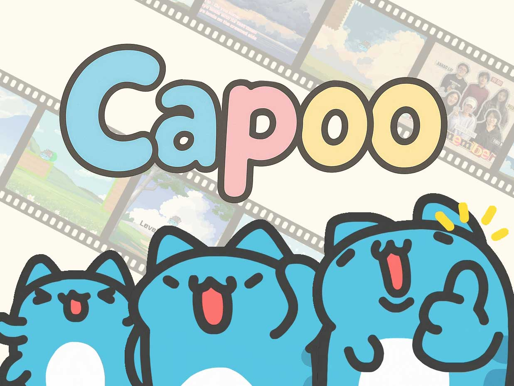
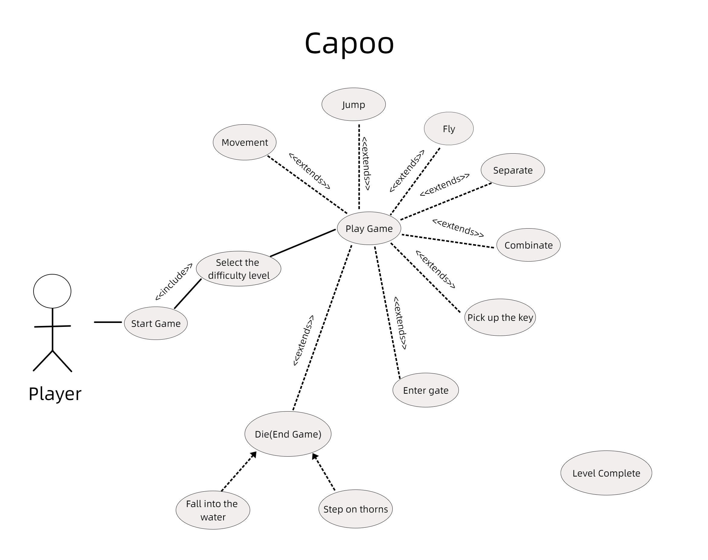

# 2025-group-3
2025 COMSM0166 group 3

## Your Game

  <a href="https://uob-comsm0166.github.io/2025-group-3/game/">🎮 Capoo Game Demo 😻</a>

 

Your game lives in the [/docs](/docs) folder, and is published using Github pages to the link above.

Include a demo video of your game here (you don't have to wait until the end, you can insert a work in progress video)

## Your Group

| Name | Email | Github | Role |
| -- | -- | -- | -- |
| Shuyin Deng | ta24493@bristol.ac.uk | @Ruby-sy | Project Manager |
| Jiaxin Fan | sg24148@bristol.ac.uk | @paidaxin760 | Technical Writer |
| Peixuan Li | ra24381@bristol.ac.uk | @pluvo070 | Developer |
| Yibu Ma | sd24536@bristol.ac.uk | @Grooveofmimosa | Developer |
| Yu Qiu | kp24679@bristol.ac.uk | @PekkaLnx | Developer |
| Jiahao Liu | qi24477@bristol.ac.uk | @TYHD759 | Test Engineer |

## Your Kanban

[Kanban board](https://github.com/orgs/UoB-COMSM0166/projects/76)

# Project Report

## Table of Contents

1. [Introduction](#1-introduction)  
2. [Requirements](#2-requirements)  
3. [Design](#3-design)  
4. [Implementation](#4-implementation)  
5. [Evaluation](#5-evaluation)  
6. [Process](#6-process)  
7. [Sustainability, Ethics and Accessibility](#7-sustainability-ethics-and-accessibility)  
8. [Conclusion](#8-conclusion)  
9. [Individual Contributions](#9-individual-contributions)  

---

## 1. Introduction

*Capoo* is a 2D puzzle-platformer that combines lighthearted gameplay with thoughtful level design. Players control Capoo, a quirky blue cat-bug hybrid, as they navigate a series of levels featuring interactive environments, platforming challenges, and environmental puzzles.

The game draws inspiration from the visual charm of *Capoo Pals* and the whimsical absurdity of *Cato*, aiming to deliver a humorous yet polished experience that balances casual accessibility with cognitive engagement.

*Capoo* introduces unique mechanics, such as the ability to separate Capoo from the can using key inputs, allowing for diverse platforming strategies. The game is structured across multiple levels, each representing increasing puzzle complexity and map decryption difficulty.

Its appeal lies in its distinctive art style, playful animations, and inventive gameplay. The development process followed agile methodologies and user-centered design, incorporating feedback from playtesting and usability evaluations.

This report documents the game's development, including requirement analysis, design, implementation, evaluation, team workflow, and sustainability aspects, highlighting key decisions, challenges, and insights gained throughout the project.

------

## 2. Requirements

### 2.1 Ideation Process

At the start of the ideation process, our team proposed two game directions based on existing titles. One was inspired by *Stardew Valley*, focusing on an RPG-like two-player game with storyline progression, environmental interaction, and boss fights. The other was based on *Cato*, featuring physics-based platforming puzzles and humorous mechanics involving a cat and a can.

To evaluate both ideas, we created simple paper prototypes during class. For the *Stardew Valley*-inspired concept, we mapped out character movement, basic dialogue trees, and interaction zones. For the *Cato*-style game, we sketched out how the two controllable characters (Capoo and the can) could move independently, interact with physics objects, and solve platforming puzzles cooperatively.

<b>Paper Prototype of Stardew Valley</b>

  <video src="https://github.com/user-attachments/assets/58f3f51d-4996-4ae9-9c22-3bd4396f7b38" controls width="600"></video>

<b>Paper Prototype of Cato</b>

  <video src="https://github.com/user-attachments/assets/e05b9fda-6a7e-4d59-81bc-7519a4a13db8" controls width="600"></video>

During discussion, we compared the scope, technical difficulty, and uniqueness of both ideas. The *Stardew Valley* concept was rich in narrative potential but required a large amount of content creation, scripting, and world-building, which exceeded the time and resource constraints of our project. In contrast, the *Cato*-like game offered a clear mechanical focus, allowed for creative level design within a manageable scope, and aligned well with our team's strengths in puzzle and physics-based gameplay design.

As a result, we unanimously chose to develop a game inspired by *Cato*, aiming to replicate its humorous tone and distinctive mechanics while introducing our own puzzle challenges and platforming dynamics through the characters Capoo and the can.

### 2.2 Stakeholder Identification

The main stakeholders for *Capoo* were:

- **Players**: End-users who play the game and provide feedback.
- **Developers**: Team members implementing game logic and features.
- **Designers**: Responsible for crafting puzzles, UI, and character behaviors.
- **Artists**: Create visual assets, animations, and icons.
- **Test Engineers**: Validate usability, performance, and stability.
- **Publishers**: Potential distributors or promoters of the final game.

Each stakeholder’s expectations were captured using epics and user stories.

### 2.3 Epics and User Stories

#### Epic: Core Gameplay (Player)

1. **As a casual gamer**, I want Capoo’s controls to be simple and intuitive so that I can jump into the game and start having fun without needing a tutorial.
2. **As a puzzle lover**, I want the levels in Capoo to offer clever environmental challenges, so I feel rewarded when I figure them out.
3. **As a curious player**, I want a lighthearted story or backstory for Capoo, so I can feel more connected to the game world.

------

#### Epic: UI and UX (Developer)

1. **As a player interested in customization**, I want to choose the difficulty level at the start, so the game fits my skill level and mood.
2. **As a new player**, I want to be guided by brief tutorials or examples that explain unique mechanics , so I don't feel confused.
3. **As a visually impaired player**, I want color-coded elements to also include shape or pattern-based distinctions, so I can still solve puzzles if I can't distinguish certain colors.

------

#### Epic: Developer-Centric 

**As a member of the development team**, I want to implement a first-in-class app/game that pushes me to learn new skills.

### 2.4 Detailed Task Breakdown

The team broke down user stories into implementable tasks. For example, the "core movement" story led to:

1. **Movement System**: Implement character locomotion with keyboard/controller.
2. **Jumping Mechanic**: Design jump arc, gravity, and mid-air control.
3. **Interaction System**: Detect interactable objects (e.g., switches, NPCs).
4. **Animation Integration**: Connect animations to movement states.
5. **Playtesting and Feedback**: Gather usability feedback to adjust control responsiveness.

### 2.5 Use Case Diagram and Specification

  

<b>Use Case Diagram</b>

------

## **3. Design**

### **3.1 Overview**

The *Capoo* project adopts an object-oriented approach to structure gameplay logic, data flow, and visual presentation. To facilitate collaborative development and modularity, we designed our architecture around clear abstractions and used UML diagrams to model our system’s behavior and structure. In particular, we utilised a **Class Diagram** to represent core entities and their relationships, and a **Sequence Diagram** to model runtime interactions, especially in puzzle-related events such as switch activation and character interaction.

------

### **3.2 Class Diagram**

Our class diagram provides a structural overview of *Capoo*’s object-oriented architecture. At its core, the system is driven by a **GameModel**, which holds references to key game objects such as platforms, interactable elements, and the player character.
 

<b>Class Diagram</b>

#### Key Components:

- **GameModel**: Serves as the central container for game state and level data. It stores all terrain, interactive elements (e.g., `Switches`, `Keys`, `ElevatingWalls`), and references to the `Capoo` character.
- **Capoo**: Inherits from `AbstractCharacter`, encapsulating properties such as position, speed, and state (e.g., `facingRight`, `isGrounded`). It is the player-controlled entity responsible for interacting with puzzles and moving across terrain.
- **Terrain & Environment**: Classes such as `Ground`, `Trap`, `Spring`, `Water`, and `Climb` inherit from `AbstractTerrain`. These are used to render the static environment and define different gameplay zones with unique physical effects.
- **Interactables**:
  - `Switches`: Can be triggered by the player or other entities. Linked to actions such as activating `ElevatingWalls`.
  - `Keystem`: Represents collectible or logic-triggering items that influence puzzle conditions.
  - `Flag`: Represents level goals or checkpoints.
  - `Potion`, `Wizard`: Dynamic game objects that can be interacted with or triggered conditionally.
- **GameController**: Controls the game loop logic including player input, game reset, and interactions. Interfaces directly with the `GameModel` and processes collision and event updates.
- **MapLoader**: Responsible for loading and parsing level data into structured game objects.
- **UI and Rendering**:
  - `GameView`: Renders the visual interface by referencing `GameModel`.
  - `RenderLogic`, `SplineLayer`, and `Cloud`: Manage background animations and UI transitions, powered by the THREE.js rendering engine.

This modular structure allows for flexible development and easy modification of individual game systems.

------

### **3.3 Sequence Diagram**

To represent dynamic gameplay interaction, we created a sequence diagram that models a typical scenario where the player activates a switch that raises a wall and unlocks a key mechanism.

<b>Sequence Diagram</b>

#### Scenario Flow :

1. Player initiates movement using key inputs processed by `GameController`.
2. `Capoo` updates its position and interacts with terrain using gravity and collision checks (e.g., `canClimb()`, `isNearPix()`).
3. A collision with a `Potion` or `Switches` object is detected:
   - For `Potion`: updates Capoo’s velocity and position.
   - For `Switch`: triggers wall movement (`ElevatingWalls`) via `setTarget()` and `updateWallPosition()`.
4. The game logic updates the visual state (`GameView.drawGameScreen()`), and the camera updates its position via `RenderLogic`.
5. Additional UI feedback is managed via the `Message` class and `Utils.showPotion()` method.

The sequence clearly demonstrates the flow of control from player input to game logic and rendering, emphasizing how interactions cascade through the system.

------

### **3.4 Design Considerations**

During design and implementation, we faced several technical challenges that led to important design decisions:

- **Modularity vs. Integration**: While we abstracted base classes such as `AbstractEntity`, `AbstractTerrain`, and `AbstractItem` to promote reusability, we needed to balance this with the tight integration required for real-time gameplay response.
- **Rendering Separation**: By offloading animation and background logic into `RenderLogic` and `SplineLayer`, we ensured a separation of concerns between game logic and rendering, improving maintainability and scalability.
- **Puzzle System Scalability**: Elements like `Switches` and `ElevatingWalls` were designed to be easily extendable by assigning ID-based triggers, supporting more complex puzzles in future levels.

------

### **3.5 Iterative Development & Diagram Updates**

Consistent with agile methodology, our class and sequence diagrams evolved over time. For example, earlier prototypes had more monolithic controller logic, but we later separated `GameController` and `MapLoader` to improve maintainability and testing. Additionally, classes such as `Capoo`, `Potion`, and `ElevatingWalls` saw expanded responsibilities as gameplay mechanics became clearer through playtesting.

------

### **3.6 Conclusion**

The UML models we developed played a crucial role in organizing our design and facilitating communication within the team. By combining a strong object-oriented foundation with agile iteration, we built a flexible and scalable game architecture that can accommodate future features such as multi-character control or extended puzzle mechanics.

## **4. Implementation & Challenges**

During the implementation of *Capoo*, we encountered several technical and architectural challenges that significantly influenced how we structured our codebase and implemented gameplay mechanics. These challenges not only tested our ability to adapt existing libraries but also reinforced the importance of good software engineering practices such as object-oriented design, modularization, and debugging of physics simulations.

We summarize our major challenges below:

------

### **Challenge 1: Spine Model Integration**

One of our key design goals was to bring the personality of Capoo to life through expressive animation. To achieve this, we used the **Spine animation model** from *Capoo Pals*. However, *p5.js*, our main framework for game logic, does not natively support Spine.

To solve this, we adopted a hybrid rendering solution:

- We integrated **Three.js** specifically to render the Spine character model.
- The game logic, UI, and gameplay rendering remained within the **p5.js** environment.

This introduced complexity in synchronising game state between the two rendering contexts. For example, the Capoo model's facing direction, animation state, and position had to be manually updated based on logic handled by `GameModel` and `Capoo` classes in p5.js. Despite the complexity, this approach allowed us to maintain p5.js’s simplicity while leveraging Three.js’s flexibility for skeletal animation.

> **Key Takeaway:** This integration allowed us to retain the charming animation style of Capoo, but required careful coordination between libraries and update loops to ensure smooth rendering.

------

### **Challenge 2: Object-Oriented Programming Refactor**

Our initial prototype was built in a **script-style format**, where all logic was spread across multiple JavaScript files attached directly to the HTML. This led to **tight coupling**, poor reusability, and difficulties in managing the growing complexity of the game logic.

To improve code structure and maintainability, we undertook a **full refactor using OOP principles**:

- We created clear class hierarchies (`AbstractEntity`, `AbstractTerrain`, `Capoo`, `Switch`, `Potion`, etc.).
- We used **encapsulation** to hide internal state and expose only necessary interfaces (e.g., `update()`, `collide()`, `move()`).
- We applied **inheritance** to create polymorphic behaviors (e.g., all terrain elements inherit from `AbstractTerrain`).
- We transitioned to **ES6 modules**, enabling better file separation and dependency management.

This refactor took nearly a full sprint but paid off by enabling cleaner logic separation, reusable systems, and better collaboration across the team.

> **Key Takeaway:** Refactoring for OOP was essential for scalability, especially with multiple types of interactive elements and physics objects sharing behavior.

------

### **Challenge 3: Physics and Collision Bugs**

Implementing reliable **physics interactions and collision detection** was another significant hurdle. Early in development, we encountered several issues:

- Capoo would **clip through terrain or platforms**, especially at corners.
- The character could get **stuck to walls**, due to overlapping bounding boxes and imprecise collision checks.
- Inconsistent jump mechanics, caused by timing issues with `isGrounded` detection and terrain state updates.

To address this, we implemented:

- A more precise **tile-based collision system**, where each entity checks collisions using adjusted hitboxes relative to its position and sprite dimensions.
- Logical state flags (e.g., `onGround`, `canJump`) to **control character state transitions** and avoid unintended behaviors.
- Frame-wise correction in `update()` methods to prevent multi-frame glitches caused by high speed or overlapping collisions.

After multiple rounds of debugging and playtesting, we were able to achieve consistent and stable interactions, with Capoo responding correctly to terrain, jump inputs, and puzzle objects like `Switches` and `Potion`.

> **Key Takeaway:** Stable and responsive physics is critical in a puzzle-platformer. Careful tuning of hitboxes and state logic was necessary to ensure playability and fairness.

------

### **Conclusion**

Each challenge forced us to adapt and improve our technical approach. From animation system integration, to architecture refactoring, to gameplay responsiveness, these implementation problems guided the evolution of *Capoo* and shaped its final experience. Despite early difficulties, they ultimately contributed to a more stable, engaging, and maintainable game.

------

## 5. Evaluation

### 5.1 Qualitative Evaluation: Heuristic Evaluation  

### 5.2 Quantitative Evaluation: NASA TLX & SUS  

### Objective

This report aims to evaluate the user experience of the platformer puzzle game "Capoo" at low difficulty (L1) and high difficulty (L2) using quantitative methods, comparing workload and usability differences.

### Background

NASA TLX is a tool for measuring subjective workload across six dimensions (Hart & Staveland, 1988). SUS is a reliable usability assessment tool (Brooke, 1986). This study combines both methods to analyze the impact of Capoo’s difficulty on player experience.

### Goals

- Quantify the workload (NASA TLX) and usability (SUS) of Capoo at L1 and L2.
- Use statistical tests to determine the significance of differences.

------

## Methodology

### Participants

- **Number**: 10 volunteers.
- **Characteristics**: Classmates with no specific gaming experience requirements.
- **Selection Method**: Random recruitment.

### Experimental Design

- **Difficulty Levels**: Capoo includes L1 (low difficulty) and L2 (high difficulty).
- **Testing Order**:
  - 5 users played L1 first, then L2.
  - 5 users played L2 first, then L1.
  - This minimizes learning effects.

### Data Collection

- **Tools**:
  - NASA TLX: 6 dimensions (raw scores).
  - SUS: 10-question survey.
- **Procedure**: Each user played one difficulty level and then filled out the NASA TLX and SUS forms, resulting in four scores per participant.

### Scoring Method

- **NASA TLX**: Dimension score = (Rating - 1) × 25, Total score = (∑ Dimension scores) / 6.
- **SUS**: Odd-numbered questions = Rating - 1, Even-numbered questions = 5 - Rating, Total score = (∑ Score contributions) × 2.5.

### Data Analysis

- **Tool**: Wilcoxon signed-rank test.
- **Online Calculator**: [Statology Wilcoxon Test Calculator](https://www.statology.org/wilcoxon-signed-rank-test-calculator/)
- **Significance Level**: α = 0.05.

------

## Results

### Data Overview

| User ID | L1 NASA TLX | L2 NASA TLX | L1 SUS | L2 SUS |
| ------- | ----------- | ----------- | ------ | ------ |
| V1      | 12.5        | 16.67       | 55     | 50     |
| V2      | 20.83       | 20.83       | 45     | 35     |
| V3      | 29.17       | 33.33       | 55     | 55     |
| V4      | 20.83       | 25          | 45     | 42.5   |
| V5      | 29.17       | 29.17       | 52.5   | 50     |
| V6      | 37.5        | 41.67       | 37.5   | 40     |
| V7      | 33.33       | 37.5        | 42.5   | 45     |
| V8      | 8.33        | 16.67       | 37.5   | 40     |
| V9      | 37.5        | 45.83       | 35     | 35     |
| V10     | 16.67       | 20.83       | 55     | 42.5   |

- **Averages**: 
  - L1 NASA TLX: 24.58, L2 NASA TLX: 28.75.
  - L1 SUS: 45.5, L2 SUS: 43.5.

#### Graphical Representation

- **Figure 1: NASA TLX Dimension Comparison**
  

- **Figure 2: SUS Score Trends**

- **Figure 3: Correlation Between SUS and NASA TLX**

### Statistical Analysis

- **NASA TLX**:
  - Wilcoxon test result: W = 36 (n=8, excluding zero values).
  - Critical value (n=8, α=0.05): 3.
  - Conclusion: W > 3, no significant difference.
- **SUS**:
  - Wilcoxon test result: W = 24 (n=8, excluding zero values).
  - Critical value (n=8, α=0.05): 3.
  - Conclusion: W > 3, no significant difference.

------

## Discussion

### Interpretation of Results

- **Workload**: L2 NASA TLX (28.75) is slightly higher than L1 (24.58), mainly due to increased physical demands (e.g., jumping) and mental effort (e.g., puzzle complexity), but the difference is not significant.
- **Usability**: L1 SUS (45.5) is slightly higher than L2 (43.5), suggesting that the increased difficulty of L2 slightly reduced perceived usability, but not significantly.

### Comparison with Expectations

- It was expected that L2 would have a higher workload and lower usability. The observed trend aligns with expectations but does not reach statistical significance, possibly due to insufficient difficulty differences.

### Design Insights

- Increase the difficulty of L2 by making jumps and puzzles more challenging to amplify workload differences.
- Optimize L2’s control smoothness (SUS Q1 and Q6 had lower scores) to reduce inconsistencies.

### Limitations

- Small sample size (10 participants) limits statistical power.
- The difficulty difference between L1 and L2 may not be significant enough to fully reflect puzzle and platforming challenges.

------

## Conclusion

Capoo’s L2 workload is slightly higher than L1 (28.75 vs 24.58), and its SUS score is lower than L1 (43.5 vs 45.5), but neither difference is statistically significant (NASA TLX W = 36, SUS W = 24, p > 0.05). It is recommended to enhance L2’s difficulty and optimize control experience to improve player immersion.

------

## Appendix

### Game Design Updates

1. **Enhance L2 Jumping Difficulty**: Increase platform height and introduce moving obstacles to heighten physical demand.
2. **Optimize Puzzle Consistency**: Standardize puzzle hint styles to improve SUS Q4 (consistency) scores.
3. **Implement Dynamic Difficulty Adjustment**: Adjust jumping and puzzle complexity based on player performance.

### 5.3 Code Testing and Debugging  

The codebase underwent multiple rounds of testing, including:

- **Unit Tests**: Written for player controls, puzzle activation, and UI visibility logic.
- **Integration Tests**: Verified smooth transitions between levels and puzzle dependencies.
- **Manual Testing**: Developers performed end-to-end playthroughs on both Windows and Android devices.

A comprehensive bug tracker was maintained using GitHub Issues. Over 30 bugs were logged and resolved throughout the testing phase.

### 5.4 Summary  

The evaluation process confirmed that *Capoo* is easy to use and cognitively manageable for casual players, even as difficulty increases. While workload and usability metrics did not show significant shifts, qualitative feedback provided actionable insights for polishing level design and improving onboarding. Heuristic evaluation revealed critical UI flaws that were successfully addressed. Ongoing testing ensured stability, performance, and a better user experience across devices.

------

## 6. Process

The development of *Capoo* adopted an agile methodology, allowing us to iterate quickly, validate ideas early, and adjust to challenges throughout the project. As a six-member team with diverse skillsets, we collaborated effectively using well-defined roles, flexible planning, and regular communication. This section outlines our workflow, tools, collaboration strategies, and reflections on key outcomes.

------

### 6.1 Teamwork and Agile Practices

At the start, our requirements were still evolving. Agile’s incremental development cycle suited our needs perfectly, allowing us to break the project into small, manageable units. Each sprint focused on delivering working features—such as camera movement, physics logic, or puzzle modules—that were tested and refined immediately.

We followed core Agile practices:

- **Weekly sprint planning** to define scope and distribute tasks.
- **Asynchronous stand-ups** on Microsoft Teams to check progress.
- **Sprint reviews** with playable builds shared for feedback.
- **Retrospectives** every Friday to reflect on pain points and improvements.

Rather than striving for perfection upfront, we emphasized continuous improvement. Working code was prioritized in each sprint, enabling us to gather regular feedback from teammates and testers. This helped identify issues like unclear UI or imbalanced difficulty early, which we could adjust in subsequent iterations.

------

### 6.2 Collaboration Tools and Workflow

We used a focused set of tools to streamline collaboration:

- **GitHub Kanban Board**: Task tracking with columns for “To Do,” “In Progress,” “In Review,” and “Done.” This visual workflow kept everyone aligned and made progress transparent.
- **P5.js**: The core development engine, used for implementing physics, UI, and gameplay.
- **Git + GitHub**: Version control with feature branches, pull requests, and code reviews.
- **Visual Studio Code**: Shared development environment across the team.
- **Microsoft Teams**: Central platform for discussion, stand-ups, and file sharing.
- **Google Forms + Excel**: Evaluation data collection and analysis (NASA TLX, SUS).
- **Miro**: Used during early ideation for wireframes and stakeholder modeling.

During development, we maintained stable code by enforcing pull request reviews and consistent branch naming. Members created feature branches, submitted pull requests after testing, and waited for peer review before merging. This process reduced bugs and ensured everyone stayed aware of changes.

------

### 6.3 Role Distribution

Each member took on a primary role while remaining flexible to support other tasks as needed:

| Name        | Role             | Responsibilities                                         |
| ----------- | ---------------- | -------------------------------------------------------- |
| Shuyin Deng | Project Manager  |        |
| Jiaxin Fan  | Technical Writer |   |
| Peixuan Li  | Developer        | Early stage prototype / Physics and collision / Main logic implementation         |
| Yibu Ma     | Developer        | OOP refactor / Spine model integration / Game website |
| Yu Qiu      | Developer        | Player interaction      |
| Jiahao Liu  | Test Engineer    | UI & Map design / Testing       |

Cross-role contributions were encouraged—for example, developers helped with writing and testing, while testers participated in prototype evaluations and level design discussions.

------

### 6.4 Highlights and Lessons Learned

- Fast Feedback Loops: In-editor playtests and quick builds allowed us to validate gameplay ideas within hours. This significantly improved iteration speed and creativity.

- Test-Driven Debugging: Having a dedicated test engineer helped identify issues early, improving overall build stability.

- Asynchronous Coordination: By relying on GitHub comments and Kanban updates, we avoided bottlenecks despite having different schedules.

- Merge Conflicts & Overlaps: Early on, lack of communication led to Git merge conflicts. We solved this by increasing pull request discipline and documenting changes clearly.

- Task Estimation Challenges: Some complex systems (e.g., modular puzzle logic) required more time than expected. We learned to plan buffer time and refine story-point estimation.

------

### 6.5 Reflection and Future Plans

The agile workflow enabled us to adapt quickly as we learned more about the game’s needs. We found that maintaining working features at all times, writing clean and commented code, and using a consistent branching model allowed for a sustainable and efficient development pace.

## 7. Sustainability, Ethics and Accessibility

### 7.1 Environmental Sustainability

Although *Capoo* is a lightweight 2D game, we made conscious decisions to minimize its environmental footprint. We optimized asset sizes, limited unnecessary visual effects, and avoided resource-heavy rendering techniques. By choosing **p5.js**—a browser-based and lightweight JavaScript library—we ensured that the game runs efficiently on low-spec hardware, reducing the energy cost required to render and interact with the game.

The game is hosted on **GitHub Pages**, a static hosting platform that reduces server overhead compared to dynamically hosted environments. While we did not measure energy use directly, our decisions were informed by a preference for minimalist design and efficient execution.

> **Reflection**: Future iterations could further reduce environmental impact by compressing image assets, optimizing animations, and exploring green hosting options for game deployment.

------

### 7.2 Social and Ethical Impact

*Capoo* was designed to be accessible and enjoyable for a broad range of casual players. The game's humorous tone, simple controls, and low cognitive demands make it approachable for players with varying levels of experience. Difficulty levels (L1 and L2) are included to cater to different preferences and skill levels.

The visual theme—centered around a whimsical character solving puzzles in a non-violent world—was deliberately chosen to promote **positive, non-aggressive play**. No enemies or combat mechanics are involved, and puzzle solutions are based on logic, timing, and creative thinking, aligning with ethical principles of inclusive and peaceful gameplay.

The development process also followed ethical software practices, including:

- **Original asset use or fair-use adaptation**.
- Respect for contributors’ time and fair role distribution.
- Transparent task tracking via GitHub for accountability.

> **Reflection**: While the game promotes positive interaction, more diverse character options and narrative depth could better represent varied social backgrounds in future expansions.

------

### 7.3 Accessibility Considerations

We made several design choices to improve accessibility:

- **Color-independent puzzle elements**: Visual indicators such as shape and motion complement color cues to aid colorblind players.
- **Simple controls**: All game mechanics are operated through standard keyboard inputs with minimal complexity.
- **Tutorial and difficulty settings**: An optional tutorial and adjustable difficulty settings help new or casual players ease into the game.
- **Responsiveness across platforms**: As a browser game, *Capoo* is accessible across Windows, macOS, and mobile browsers without installation.

> **Reflection**: While the game accommodates casual play and basic visual limitations, it lacks full accessibility features such as screen reader support. In future versions, we aim to add audio cues to improve inclusiveness.

------

### 7.4 Sustainability-Oriented Requirements

Our project team used the **Sustainability Awareness Framework (SusAF)** to guide decisions across environmental, social, and technical dimensions. The following are sample user stories reflecting our sustainability mindset:

**Environmental Requirements**

- *As a developer*, I want to reduce asset size and rendering load so that the game uses less GPU power.
- *As a maintainer*, I want to reuse code components to minimize redundancy and improve efficiency.

**Social Requirements**

- *As a new player*, I want an easy mode with guided controls so that I can learn the game comfortably.
- *As a colorblind user*, I want non-color-based cues to help me navigate puzzles.

**Technical Requirements**

- *As a developer*, I want modular systems for puzzle logic so that I can extend levels without major code rewrites.
- *As a tester*, I want the game to run in a browser so it can be tested on different devices easily.

------

This section concludes our discussion on how *Capoo* was built with sustainability and accessibility in mind, while acknowledging future improvements that can be made in hosting efficiency, inclusive design, and social representation.

------

## 8. Conclusion

The development of *Capoo* was a rewarding yet technically demanding experience that significantly strengthened our software engineering and collaboration skills. Building a physics-based puzzle-platformer with charming visuals and modular design required us to navigate a range of challenges—from integrating Spine animations with p5.js to implementing precise, bug-free collision mechanics.

One of the defining features of our development journey was the decision to refactor our early procedural code into a fully object-oriented system. While time-consuming, this refactor paid off by making our codebase more scalable and maintainable, which proved essential as new gameplay elements like potions, switches, and modular puzzles were introduced. The class and sequence diagrams helped the entire team—regardless of their background—understand system structure and dependencies, enabling more efficient implementation and debugging.

Agile methodology also played a critical role in the success of this project. Through regular sprint planning, retrospectives, and asynchronous updates, we maintained a clear development pace while remaining flexible enough to respond to technical hurdles and player feedback. For example, early usability testing revealed that tutorial screens were confusing and some levels lacked clear feedback cues. By integrating heuristic evaluations and SUS/NASA TLX assessments into our workflow, we systematically addressed these issues, improving both clarity and user engagement.

Despite our progress, there are areas we could have improved. Early integration between Three.js and p5.js lacked a clearly defined communication layer, which caused synchronization issues in animations and input feedback. Additionally, adopting more rigorous unit testing earlier in the project—especially for collision detection and interaction systems—could have saved time debugging later. We also encountered minor setbacks with Git merge conflicts, which highlighted the importance of consistent communication and clearer task allocation.

Looking ahead, we see multiple opportunities to extend *Capoo*. These include designing additional levels with dynamic puzzle mechanics, implementing audio cues for accessibility, and eventually creating a mobile-optimized version. The game’s architecture already supports modularity, which will make future expansion feasible without major rewrites.

Above all, this project gave us our first taste of end-to-end game development in a team setting. Each member brought their strengths—whether in coding, design, testing, or coordination—and learned to adapt to new responsibilities. *Capoo* is not just a game, but the culmination of our collaborative problem-solving, technical growth, and commitment to delivering a creative and enjoyable experience.

## 9. Individual Contributions

| Name            | Role             |  Contributions |
| --------------- | ---------------- | ----------------- |
| **Shuyin Deng** | Project Manager  | 1                 |
| **Jiaxin Fan**  | Technical Writer | 1                 |
| **Peixuan Li**  | Developer        | 1                 |
| **Yibu Ma**     | Developer        | 1                 |
| **Yu Qiu**      | Developer        | 1                 |
| **Jiahao Liu**  | Test Engineer    | 1                 |

---

### Introduction

- Describe your game, what is based on, what makes it novel? 

### Requirements 

- 15% ~750 words
- Use case diagrams, user stories. Early stages design. Ideation process. How did you decide as a team what to develop? 

### Design

- 15% ~750 words 
- System architecture. Class diagrams, behavioural diagrams. 

### Implementation

- 15% ~750 words

- Describe implementation of your game, in particular highlighting the three areas of challenge in developing your game. 

### Evaluation

- 15% ~750 words

- One qualitative evaluation (your choice) 

- One quantitative evaluation (of your choice) 

- Description of how code was tested. 

### Process 

- 15% ~750 words

- Teamwork. How did you work together, what tools did you use. Did you have team roles? Reflection on how you worked together. 

### Conclusion

- 10% ~500 words

- Reflect on project as a whole. Lessons learned. Reflect on challenges. Future work. 

### Contribution Statement

- Provide a table of everyone's contribution, which may be used to weight individual grades. We expect that the contribution will be split evenly across team-members in most cases. Let us know as soon as possible if there are any issues with teamwork as soon as they are apparent. 

### Additional Marks

You can delete this section in your own repo, it's just here for information. in addition to the marks above, we will be marking you on the following two points:

- **Quality** of report writing, presentation, use of figures and visual material (5%) 
  - Please write in a clear concise manner suitable for an interested layperson. Write as if this repo was publicly available.

- **Documentation** of code (5%)

  - Is your repo clearly organised? 
  - Is code well commented throughout?
