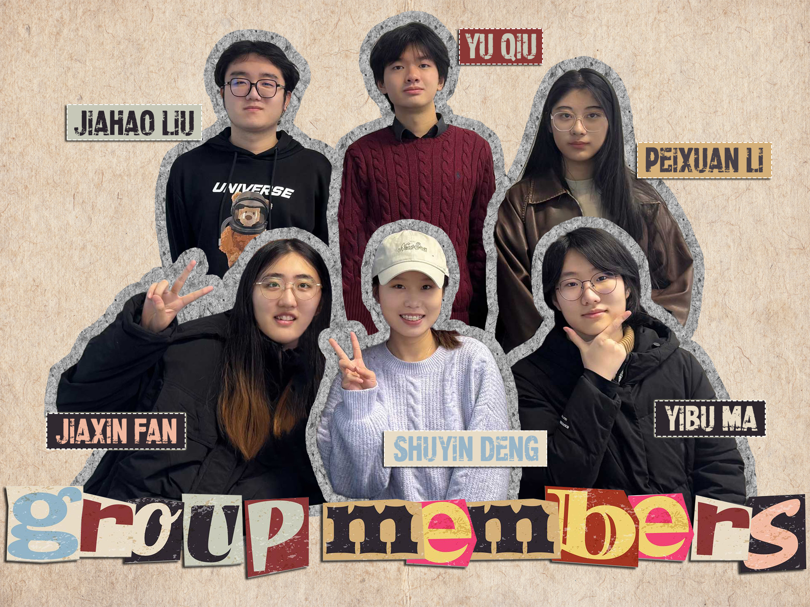

# 2025-group-3
2025 COMSM0166 group 3

## Your Game

  <a href="https://uob-comsm0166.github.io/2025-group-3/game/">🎮 Capoo Game Demo 😻</a>

 

Your game lives in the [/docs](/docs) folder, and is published using Github pages to the link above.

Include a demo video of your game here (you don't have to wait until the end, you can insert a work in progress video)

## Your Group

| Name | Email | Github | Role |
| -- | -- | -- | -- |
| Shuyin Deng | ta24493@bristol.ac.uk | @Ruby-sy | Project Manager |
| Jiaxin Fan | sg24148@bristol.ac.uk | @paidaxin760 | Technical Writer |
| Peixuan Li | ra24381@bristol.ac.uk | @pluvo070 | Developer |
| Yibu Ma | sd24536@bristol.ac.uk | @Grooveofmimosa | Developer |
| Yu Qiu | kp24679@bristol.ac.uk | @PekkaLnx | Developer |
| Jiahao Liu | qi24477@bristol.ac.uk | @TYHD759 | Test Engineer |

## Your Kanban

[Kanban board](https://github.com/orgs/UoB-COMSM0166/projects/76)

## Project Report

### 1. Game Reserch
| **Game Type** | **Game Inspiration** | **Game Description** | **Possible Game Twists** |
|-----------------|------------------------|------------------------|----------------------------|
| **🌱 Simulation, RPG** | 🏡 **Stardew Valley** | A game combining **farm management, social interaction, exploration, and combat.** Players manage their farm, interact with NPCs, and explore unknown areas. | ✨ Add a **magic system,** random events, or **dynamic weather** affecting crop growth. |
| **⚔️ Strategy RPG** | 🏰 **The DioField Chronicle** | A **real-time tactical battle** game blending **political storytelling** and **strategic warfare**. Players **lead armies** and influence the story. | 🔀 Add **multiple endings** or introduce a **customizable character development path**. |
| **🔫 Roguelike Action** | 💥 **Neon Abyss** | A **fast-paced shooting game** featuring **procedurally generated levels** and various **weapon upgrades**. | 🎯 Introduce **character progression mechanics**, **increase long-term growth**, or **add random combat-affecting events**. |
| **🧪 Crafting Simulation** | 🏺 **Potion Craft: Alchemist Simulator** | Players take on the role of an **alchemist**, combining ingredients to craft potions while managing a shop. | 🏆 Add **alchemy duels** or introduce **hidden quests & unique customer requests**. |
| **🏰 Tower Defense** | 🎈 **Bloons Tower Defense** | Players **place and upgrade towers** to **prevent balloon waves** from reaching their goal. | 🎭 Introduce a **PVP mode** or **dynamic map alterations**. |
| **🏰 Tower Defense** | 🏹 **Kingdom Rush** | A **tower defense game** with **hero units** and **diverse upgrade options** against enemy waves. | 🦸 Add **RPG mechanics** allowing **direct hero control in battles**. |
| **🧗 Platformer** | 🌄 **Celeste** | A **platforming game** about **climbing Celeste Mountain**, featuring **precise controls & emotional storytelling**. | ⏳ Add a **time trial mode** or a **level editor** for **custom challenges**. |
| **⚔️ MMORPG, Action** | 🏆 **Dungeon Fighter Online (DNF)** | A **side-scrolling action MMORPG**, blending **dungeon exploration** and **character development**. Players **level up & collect loot**. | 🎮 Introduce **PVP arenas** or **dynamic event dungeons**. |
| **🃏 Roguelike Deck-Building** | 🎴 **Slay the Spire** | Players **build a deck** and battle through **procedurally generated levels**, making each run unique. | 🤝 Introduce **co-op** or **PVP battle modes** for **competitive deck-building**. |
| **🗡️ Roguelike Metroidvania** | 🔥 **Dead Cells** | A **Metroidvania-style combat game** with **procedurally generated dungeons & fluid combat**. | ⚙️ Add a **customizable weapon system** or **multi-character control mechanics**. |
| **💀 Action Roguelike** | ⚔️ **Skul: The Hero Slayer** | Players control **a small skeleton warrior** who can **acquire and switch hero abilities**. | 🏅 Introduce **PVP battles** or **expand the number of transformable heroes**. |
| **🏛️ Action Roguelike** | 🔱 **Hades** | Players control **Zagreus, the son of Hades**, trying to escape the underworld. Each failure **progresses the story**. | 👹 Add a **'Nightmare Mode'** with **stronger enemies** or **randomized skill selection**. |
| **🧛 Survival, Roguelike** | 🦇 **Vampire Survivors** | Players **auto-attack and upgrade abilities**, surviving **endless enemy waves**. | 💡 Add a **character talent system** or **customizable attack styles**. |
| **🏰 Strategy, Simulation** | 👑 **Kingdom: Two Crowns** | Players **manage and expand their kingdom** while **defending against nightly monster invasions**. | 🌦️ Introduce **seasons affecting resources** or **AI-controlled kingdoms competing dynamically**. |
| **🃏 Card Game** | 🔮 **Hearthstone** | A **card battle game** set in the **World of Warcraft universe**, where players **build decks & compete**. | 🎭 Introduce **new game modes**, such as **'Survival Mode'** where players **continuously battle AI opponents**. |
| **💣 Action, Multiplayer** | 💥 **Bomberman Online** | A **classic multiplayer battle game**, where players **place bombs to eliminate opponents** within a time limit. | 🌪️ Introduce **randomized maps** or **weather effects affecting bomb explosions**. |

### 2. Final Idea

# 🌾 **Stardew Valley**  
### 🎮 **Genre:** Simulation RPG  

## 🎯 **Introduction**  
**Stardew Valley** is a **farming and life simulation game**, where players **inherit a rundown farm** from their grandfather in a **small rural town**. The game revolves around **rebuilding the farm**, **forming relationships with the townspeople**, and **balancing resource management with personal life**. With **open-ended gameplay**, players can choose their own path, whether it's **farming, fishing, mining, crafting, or socializing**.

---

## 🕹️ **Core Gameplay Elements**  

### 🌱 **Farming & Resource Management**  
- **Grow crops, raise animals, and manage farm resources** to build a thriving homestead.  
- **Seasonal changes** impact **crop availability, weather, and activities**.  
- **Crafting and cooking** allow players to create useful tools and meals.  

### 🏡 **Community Interaction**  
- The town is filled with **diverse NPCs**, each with **unique personalities, schedules, and storylines**.  
- **Friendships & Romances**:  
  - Building relationships unlocks **cutscenes, dialogues, and events**.  
  - Players can **date, marry, and even start a family**.  

### ⛏️ **Exploration & Combat**  
- **Explore dangerous mines** to gather valuable **resources, ores, and gems**.  
- **Combat mechanics** allow players to **fight monsters and uncover treasures**.  
- **Fishing & Foraging** provide additional activities for relaxation and progression.  

### 🎨 **Customization & Creativity**  
- **Personalize farm layouts**, **decorate the house**, and **craft unique tools**.  
- **Farm expansion & upgrades** provide long-term goals.  

### 🔀 **Freedom & Choice**  
- **Non-linear gameplay** allows players to focus on their favorite activities.  
- **Multiple progression paths**: **farming, socializing, mining, fishing, crafting, or a mix of everything**.  

---

## ❤️ **Themes & Appeal**  
- **A nostalgic and relaxing experience** with a **focus on self-sufficiency and community bonding**.  
- **Heartwarming storytelling** that embraces themes of **rural life, connection, and personal growth**.  
- **A rewarding sense of achievement**, as players **watch their farm flourish over time**.  

---

## ⚙️ **Development & Technical Aspects**  
- **Developed by ConcernedApe (Eric Barone)** as a **solo project**.  
- Inspired by **Harvest Moon**, but with **deeper mechanics and open-ended gameplay**.  
- **Pixel art aesthetic** with **handcrafted animations**.  
- **Modding support** allows the community to expand the game further.  
### 🌾 **Rebuild, Connect, and Live Your Dream Farm Life!**  [Watch Week 3 - PPT Prototype 02 (MP4)](https://github.com/UoB-COMSM0166/2025-group-3/blob/main/weekly%20updates/Week%203%20-%20PPT%20Prototype%2002.mp4)
---
# 🐱 **Cato**   
### 🎮 **Genre:** 2D Puzzle-Platformer  

## 🎯 **Introduction**  
**Cato (Butter Cat)** is a **physics-based puzzle platformer** inspired by the **buttered cat paradox** meme. In this **hilarious and absurd world**, a **cat with a slice of buttered toast strapped to its back** hovers uncontrollably due to **the paradox of the toast always trying to land butter-side down**. Players must **master the erratic spinning physics** to **solve puzzles, overcome obstacles, and uncover the secrets of the paradox**.

---

## 🕹️ **Core Gameplay Elements**  

### 🌀 **Physics-Based Movement**  
- **Cato continuously spins or hovers**, creating **chaotic yet skill-based movement mechanics**.  
- Players must **control Cato’s momentum and rotation** to **traverse obstacles and land precisely**.  

### 🧩 **Puzzle Challenges**  
- **Manipulate spinning motion** to **activate switches, flip levers, and solve environmental puzzles**.  
- **Skillful timing and strategic positioning** are essential for **navigating complex stages**.  

### 🎨 **Creative Level Design**  
- **Physics-defying environments**, including:  
  - 🌀 **Anti-gravity zones**  
  - 💨 **Wind tunnels**  
  - 🧲 **Butter magnets**  
  - 🍞 **Toast-eating enemies**  
- **Dynamic obstacles and interactive elements** provide a constantly evolving challenge.  

### 🎭 **Humorous Storyline**  
- **An absurd, meme-inspired adventure** where Cato embarks on a quest to **unravel the paradox**.  
- **Eccentric NPCs**, including:  
  - 🔬 **Mad scientists** experimenting on physics theories.  
  - 🐱 **Rival cats** competing for "The Ultimate Paradox Cat" title.  
  - 🍞 **Bread-themed villains** trying to capture the perfect toast.  

### 🎨 **Customization & Power-Ups**  
- **Unlockable skins** for Cato, featuring **hats, colors, and hilarious outfits**.  
- **Butter-toast power-ups**, including:  
  - **Sticky Butter** 🧈 (Better grip on walls)  
  - **Turbo Spin** 🔄 (Higher jumps)  
---
## 🔥 **Themes & Appeal**  
- **Lighthearted and comedic**—perfect for fans of **quirky indie games** and **physics-based mechanics**.  
- **A mix of skill, timing, and absurd humor** keeps players engaged.  
- **Appeals to casual and hardcore gamers** due to its **simple premise but challenging execution**.  
---
## ⚙️ **Development & Technical Aspects**  
- Developed by **Hyper Luminal Games**.  
- **Physics engine designed around momentum-based movement**.  
- **Hand-drawn 2D animation** with **charming, cartoon-style visuals**.  
- **Potential modding support** for custom levels.
### 🐱 **Spin, Solve, and Defy Gravity in a Buttered Chaos!**  [Download Week 3 - PPT Prototype 02 (PPTX)](https://github.com/UoB-COMSM0166/2025-group-3/blob/main/weekly%20updates/Week%203%20-%20PPT%20Prototype%2002.pptx)
---

### Introduction

- Describe your game, what is based on, what makes it novel? 

### Requirements 

- 15% ~750 words
- Use case diagrams, user stories. Early stages design. Ideation process. How did you decide as a team what to develop? 

### Design

- 15% ~750 words 
- System architecture. Class diagrams, behavioural diagrams. 

### Implementation

- 15% ~750 words

- Describe implementation of your game, in particular highlighting the three areas of challenge in developing your game. 

### Evaluation

- 15% ~750 words

- One qualitative evaluation (your choice) 

- One quantitative evaluation (of your choice) 

- Description of how code was tested. 

### Process 

- 15% ~750 words

- Teamwork. How did you work together, what tools did you use. Did you have team roles? Reflection on how you worked together. 

### Conclusion

- 10% ~500 words

- Reflect on project as a whole. Lessons learned. Reflect on challenges. Future work. 

### Contribution Statement

- Provide a table of everyone's contribution, which may be used to weight individual grades. We expect that the contribution will be split evenly across team-members in most cases. Let us know as soon as possible if there are any issues with teamwork as soon as they are apparent. 

### Additional Marks

You can delete this section in your own repo, it's just here for information. in addition to the marks above, we will be marking you on the following two points:

- **Quality** of report writing, presentation, use of figures and visual material (5%) 
  - Please write in a clear concise manner suitable for an interested layperson. Write as if this repo was publicly available.

- **Documentation** of code (5%)

  - Is your repo clearly organised? 
  - Is code well commented throughout?
